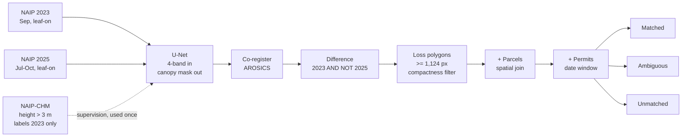

# Permits & Pixels

**Implementation spec: how to get Atlanta's permit data, and exactly how the ML gets built.**

| | |
|---|---|
| Status | Ready to execute |
| Last updated | 2026-09-18 |
| Companion | `canopy-ledger.md` (problem definition) |

---

# Part one · The permit data

> **Definitive answer: yes, you can get it.** Three sources are already public and downloadable without permission, and Georgia law obliges the city to produce the fourth in machine-readable form.

An earlier draft called this the project's critical path and the thing most likely to sink it. That was too pessimistic. The blocking risk is not access — it is that tree-specific records are scattered across four systems with different shapes, so the work is **assembly rather than acquisition**.

## The ladder, in working order

### Tier 1 — Bulk CSV, already exported from Accela · *download today*

**All Building Permits 2019–2024** — an 11.6 MB CSV published on both the Atlanta Regional Commission hub and the City of Atlanta Department of City Planning GIS hub, described in its own metadata as "pulled from the Accela database." Carries permit status (in review / issued / closed), zoning, land use from GIS at time of application, and latitude/longitude. No license attached; only the city's own "use at your own risk" disclaimer.

This is the most useful item on the list, because it lets you build and debug the entire reconciliation stage before any tree-specific data arrives. It is also proof the city already runs bulk exports out of Accela — which matters enormously for Tier 4.

**Limits.** Ends at 2024, and these are building permits rather than arborist records. Ask ARC or DCP GIS for a 2025–2026 refresh; someone runs that export on a schedule.

### Tier 2 — Accela Citizen Access, no login required · *scrapeable*

Atlanta's tenant sits at `aca-prod.accela.com/ATLANTA_GA`. Trees Atlanta's own public guidance to residents states plainly that no login is needed: choose "Search Permits/Complaints" under the Building category and every permit application filed in the city is there as a public record.

Arborist-relevant record types documented by tree advocates: DDH tree removals, construction and demolition, landscape, silvicultural, nuisance tree, location-to-house.

Feasibility is not in question — commercial scrapers already read Accela's public search grids across arbitrary tenants with no API key, and one Atlanta-specific scraper claims 35,000+ records pulled from the ArcGIS feature service behind the system. Write your own for a research project, identify your user agent, rate-limit politely.

**What is closed.** Accela's official REST API. The developer portal and the `accelapy` Python client both require agency credentials — client ID, secret, username, password. The API route only opens if the city sponsors you. Ask, but don't plan on it.

### Tier 3 — Arborist sign postings · *the only live feed, start today*

The city maintains a page listing current arborist sign postings. The signs have legal meaning and fixed durations:

| Sign | Meaning | Posting period |
|---|---|---|
| Orange | Permit applied for | 10 days |
| Yellow | Preliminary arborist approval | 5 days — **the only appeal window** |
| White | Appeal filed, hearing scheduled | — |

**There is no archive.** The page shows what is current. That is an opportunity: a daily scrape started this month builds a longitudinal record of pending removals that nobody — including the city — currently holds. It costs one scheduled job and it is the only source capturing intent *before* the trees come down.

### Tier 4 — Open records request · *file week one*

Georgia's Open Records Act, **O.C.G.A. § 50-18-71**, requires a response within **three business days**. If responsive records exist but cannot be produced that fast, the agency must supply a description and a timeline, then deliver as soon as practicable. Fees cap at 10¢ per page for standard copies, staff time at no more than the prorated hourly salary of the lowest-paid full-time employee with the necessary skill, and **the first quarter hour is free**. A modest, well-scoped request should cost nothing.

The decisive provision is subsection (f), on electronic records:

> An agency must produce electronic copies from its databases, and may not refuse on the ground that producing them requires export commands, so long as those commands can be executed using existing computer programs. The requester may specify the format in which the data are kept, or a standard export format.

That settles it. **"We only publish PDFs" is not a lawful response** when the underlying records live in Accela. And you are not asking for anything exotic: Section 158-103(f) of the tree ordinance already requires the city to produce quarterly tree activity reports, and it publishes them for FY2014 through FY2023 — as PDFs. You are asking for the table behind a report they already compile, from a database they already bulk-export for Tier 1.

#### Draft request

> Pursuant to the Georgia Open Records Act, O.C.G.A. § 50-18-70 et seq., I request the following records in electronic form:
>
> All tree removal permit and arborist review records from January 1, 2019 to the present, including for each record: record number, record type, application date, issue date, status, site address, parcel identifier, number of trees approved for removal, species and diameter at breast height where recorded, recompense assessed, and recompense paid.
>
> Pursuant to § 50-18-71(f), I request these records as a delimited electronic export (CSV or equivalent) from the system in which they are maintained, rather than as printed or scanned documents. I understand the agency may not decline electronic production on the basis that it requires database export commands where those commands can be executed with existing programs.
>
> I am a student researcher at [institution] and this request is for non-commercial academic purposes. If fees will exceed $25, please contact me before proceeding. If any portion is denied, please cite the specific statutory exemption.

Send to `Arborist.dpcd@atlantaga.gov` and the city's open records channel simultaneously. Keep the written trail — enforcement under the Act is only available on written requests.

### Tier 5 — Fallback · *degraded but viable*

Reconcile detected clearing against the Tier 1 building-permit CSV alone. The claim weakens from "clearing with no tree permit" to "clearing with no associated development permit" — looser, but still real and reportable. Given Tier 1 is confirmed downloadable, **the project cannot fail on data access.**

## Five caveats that will bite you later

| Caveat | Consequence |
|---|---|
| Public land is excluded | City tree data covers private property; Parks tracks public trees separately. Clip parks and city-owned parcels, or request Parks records separately. |
| Dead/dying trees get free permits | "Permitted" ≠ "no canopy lost." A legitimate hazard removal is still real loss — your loss total and violation list are different numbers, reported separately. |
| Emergency removals are retroactive | Storm-damage cutting is allowed before the permit, with the permit due within five working days. Date-matching windows must be generous both directions. |
| A permit is not a removal | Permits get issued and never acted on. The join tells you a removal was *authorized*; the imagery establishes it *happened*. |
| Arborist reviews may be embedded in building records | Reporting suggests that since Aug 2020 arborist review rides inside building permit records. **Treat as a hypothesis, test against Accela in week two** — it changes which record types you scrape. |

## Week one checklist

- [ ] Download the Tier 1 CSV (five minutes, unblocks the reconciliation stage)
- [ ] Send the Tier 4 request (three business days to an answer)
- [ ] Stand up the Tier 3 daily scrape (every day of delay is unrecoverable history)
- [ ] Spend twenty minutes in Accela by hand; write down the record-type prefixes you actually see

---

# Part two · How the ML gets built

At 60 cm over the City of Atlanta this is a small problem. Free Colab or Kaggle GPU time is genuinely sufficient; the bottleneck is labeling effort and validation discipline, not compute.

| Metric | Value |
|---|---|
| Pixels per band covering the city at 60 cm | 978 M |
| Non-overlapping 512×512 tiles per epoch | 3,732 |
| Raw 4-band imagery per epoch, uncompressed | 3.9 GB |
| 0.1-acre minimum mapping unit, in pixels | 1,124 |

For scale: the Christchurch study that sets your accuracy benchmark worked at 7.5 cm over a smaller area — about **21× more pixels** than you will process. Their inference run took 15 days. Yours is a long afternoon.

## The design decision that simplifies everything

You have a free canopy-height product, NAIP-CHM, whose training imagery is 96% from 2022–23. That makes it a trustworthy label source for your 2023 epoch and an extrapolation for 2025. The instinct is to worry about that gap. Don't — exploit it:

> **Train the canopy model once, with 2023 supervision only, then run that same frozen model over both epochs.**

Differencing two outputs of one model is far better behaved than differencing outputs of two separately-supervised models, because systematic model bias largely cancels in the subtraction. You never need a label source for 2025.

The residual risk becomes domain shift: 2025 imagery may be 30 cm rather than 60 cm, flown in different months by a different sensor. Manage that with aggressive radiometric augmentation during training and a small hand-labeled 2025 validation set. Much smaller problem than sourcing 2025 labels.



## Vintage of every input, as of September 2026

| Input | Acquired | Age today | Where it actually lives |
|---|---|---|---|
| NAIP 2019 | 8 Sep – 20 Nov 2019 | ~7 yr | Everywhere — Planetary Computer, Earth Engine, AWS, USGS |
| NAIP 2021 | 7 Oct 2021 – 13 Jan 2022 | ~5 yr | Everywhere, but leaf-off — **do not use** |
| NAIP 2023 | 12 Sep – 1 Nov 2023 | ~3 yr | Everywhere. Both cloud catalogs end just after this flight |
| **NAIP 2025** | **13 Jul – 16 Oct 2025** | **~11 mo** | **USDA channels only** — NAIP GeoHub, EarthExplorer, Geospatial Data Gateway. *Not* on Planetary Computer, Earth Engine or AWS |
| Georgia LiDAR | Nov 2018 – Apr 2019 | ~7.5 yr | USGS 3DEP, OpenTopography — leaf-off, describes stems not canopy |
| NAIP-CHM heights | Built from 2022–23 NAIP | ~3 yr | Earth Engine asset, COGs — aligned to your 2023 epoch |
| GT canopy study | WorldView-2, 2023 | ~3 yr | Published Aug 2026 — validation only, not training truth |

### How often Georgia gets re-flown

**Every two years, reliably, for a decade.** NAIP's program-level standard is a two-to-three-year cycle per state; Georgia sits at the fast end, with verified acquisitions in **2015, 2017, 2019, 2021, 2023 and 2025** — no gaps. Next Georgia flight should be **2027**, flown July–October, publicly distributed sometime in 2028.

That cadence is the natural clock for this project. Refresh rate is once every two years, which means the tool is a repeatable audit a successor team or the city re-runs each cycle. The honest ceiling on responsiveness is two years plus roughly a year of processing lag: about three years from a tree falling to a fresh epoch that can see it. Say that plainly — anyone who works with NAIP already knows it.

Flight *windows* drift within the year, which matters more than the cadence. Across six Georgia cycles the window has ranged from a July start (2025) to a December acquisition (2017) to an October–January run (2021). Phenology, not the calendar, decides whether an epoch is usable.

### The catalog trap

Every convenient analysis-ready catalog stops at 2023. Planetary Computer's NAIP collection ends 31 December 2023, Earth Engine's ends 17 November 2023, the AWS open-data buckets run "2010 through 2023." Meanwhile USDA's own channels confirm the 2025 acquisitions are available, with about half the states delivered at 60 cm and half at 30 cm. Georgia's 2025 flight is real and dated.

**The freshest imagery is not on the easy path.** Budget a week for bulk download and tiling from USDA rather than assuming a STAC query will hand it to you. Confirm Georgia's 2025 GSD on arrival — if it came back at 30 cm you must resample to 60 cm before differencing against 2023, or your two masks will disagree for purely geometric reasons.

### What this means for the pitch

Your newest evidence will be ~11 months old when you start and ~18 months old when you present. **That is not real-time enforcement and you should never describe it that way.** It is a large improvement on the status quo: the city's 2023 canopy imagery was published in August 2026, a lag of nearly three years, inside a five-year cycle. You roughly halve the lag and double the refresh rate, and your product updates every time NAIP lands rather than every time the city commissions a study. Frame it as a two-year audit cycle.

## Stack

| Layer | Choice | Why |
|---|---|---|
| Imagery access | `pystac-client` for 2023; bulk download for 2025 | Cloud catalogs all end at 2023 |
| Raster I/O | `rasterio`, `rioxarray` | Windowed reads — never load a full quad |
| Model | `segmentation-models-pytorch` | U-Net with 4-channel stem in three lines |
| Pretrained weights | TorchGeo NAIP/Chesapeake weights | Trained on 4-band NAIP-like imagery, unlike ImageNet |
| Co-registration | `arosics` | Purpose-built sub-pixel alignment; not optional |
| Vector work | `geopandas`, `shapely`, `scikit-image` | Polygonization, morphology, spatial joins |
| Annotation | QGIS + `segment-geospatial` (SAM) | Box-prompt SAM to draft, hand-correct edges; ~5× faster |
| Compute | Colab or Kaggle free GPU | Sufficient at this scale |

## Phase by phase

### P0 — Acquire from two different places, check dates first

The first gate is acquisition dates, not code quality. Georgia NAIP is flown late and the statewide window does not apply uniformly to your quads.

```python
import planetary_computer as pc
import pystac_client

catalog = pystac_client.Client.open(
    "https://planetarycomputer.microsoft.com/api/stac/v1",
    modifier=pc.sign_inplace,
)

ATL = [-84.552, 33.647, -84.289, 33.887]   # City of Atlanta bbox

# 2023 comes from the cloud catalog. 2025 does NOT -- see note below.
items = list(catalog.search(
    collections=["naip"], bbox=ATL,
    datetime="2023-01-01/2023-12-31",
).items())

print("2023 quads:", len(items))
for it in sorted(items, key=lambda i: i.datetime):
    print("  ", it.id, it.datetime.date(), it.properties.get("gsd"))
```

> **2025 is not in any cloud catalog.** Pull it from the USDA NAIP GeoHub, USGS EarthExplorer, or the NRCS Geospatial Data Gateway as compressed county mosaics or DOQQ tiles, then build your own tile index. To check dates before downloading, query the USDA image-date feature service for Georgia 2025 with an Atlanta bounding box and read the `IDATE` field per quad.

### P1 — Pseudo-labels from height plus a vegetation gate

NAIP-CHM models the whole vertical landscape — vegetation, buildings and infrastructure alike — so height alone labels rooftops as canopy. Gate it with NDVI from the NAIP bands themselves.

```python
import numpy as np

# NAIP band order: 0=R, 1=G, 2=B, 3=NIR
def canopy_pseudolabel(naip, chm, h_thresh=3.0, ndvi_thresh=0.20):
    r   = naip[0].astype("float32")
    nir = naip[3].astype("float32")
    ndvi = (nir - r) / (nir + r + 1e-6)
    return ((chm > h_thresh) & (ndvi > ndvi_thresh)).astype("uint8")
```

Generate across the whole city for 2023, then hand-correct 150–250 tiles **sampled to span the canopy-density range** — not a random sample, which would be dominated by the leafy north side. Those corrected tiles are your fine-tuning set and, held out, your honest validation set.

### P2 — Train, with radiometric augmentation as the main regularizer

```python
import segmentation_models_pytorch as smp
import torch.nn as nn

model = smp.Unet(
    encoder_name="resnet34",
    encoder_weights="imagenet",   # prefer TorchGeo NAIP weights if available
    in_channels=4,                # smp adapts the stem conv for you
    classes=1,
)

dice = smp.losses.DiceLoss(mode="binary")
bce  = nn.BCEWithLogitsLoss()
criterion = lambda p, y: dice(p, y) + bce(p, y)
```

Train on pseudo-labels first, then fine-tune on hand-corrected tiles at a lower learning rate. Augment with flips and 90° rotations, and — the part people skip — per-channel brightness, contrast and gamma jitter. NAIP radiometry varies visibly between adjacent flight lines within a single year. **Colour augmentation is not cosmetic here; it is the mechanism by which your 2023-trained model survives contact with 2025 imagery.**

### P3 — Co-register before differencing, not after

```python
from arosics import COREG_LOCAL

CRL = COREG_LOCAL(
    im_ref=path_2023, im_tgt=path_2025,
    grid_res=200, window_size=(256, 256),
    max_shift=20, path_out=path_2025_coreg,
)
CRL.correct_shifts()
```

Run per quad on the imagery, before inference. Inspect the shift field AROSICS reports. Small random shifts are normal; a large systematic shift across a whole quad means a projection or geotransform problem, and you want to know before it silently becomes a ring of false "loss" around every tree crown.

### P4 — Difference, then throw most of it away

Raw differencing produces a great deal of garbage: single-pixel speckle, shadow flicker, thin slivers along every canopy edge where the epochs disagree by a pixel.

```python
from skimage.morphology import binary_opening, disk, remove_small_objects
from skimage.measure import label, regionprops

MMU_PX = 1124          # 0.1 acre at 60 cm

raw    = mask_2023 & ~mask_2025
opened = binary_opening(raw, disk(2))          # kill speckle
lab    = remove_small_objects(label(opened), min_size=MMU_PX)

keep = []
for r in regionprops(lab):
    compactness = (r.perimeter ** 2) / r.area   # circle = 12.6
    if compactness < 60:                        # reject edge slivers
        keep.append(r.label)
```

The compactness threshold is the interesting one. A real clearing is a blob; a registration artefact is a long thin ribbon tracing a canopy edge. Squared-perimeter over area separates them: a circle scores 12.6, a 1:10 ribbon about 48. **Tune the cutoff on your own validation tiles rather than trusting 60.**

### P5 — Attribute, classify cause, reconcile

Spatially join surviving polygons to parcels, then classify loss type from evidence in the imagery: new impervious surface or a graded pad in the later epoch reads as development; scattered single-crown gaps read as mortality or storm; linear clearing along a corridor reads as utility or roadway work. Use severe-weather records as a negative filter — if a datable storm falls inside the loss window and the pattern is scattered rather than blocked, don't flag it.

Then join to permits with a generous date window both directions, and emit **three buckets: matched, unmatched, and ambiguous.** Collapsing ambiguous into unmatched is how a tool like this loses an agency's trust permanently, and you only get to lose it once.

### P6 — Validate like someone is trying to discredit you

Because in Miami, someone was, and they succeeded. In order of how much a skeptic will care:

1. **Spatially blocked splits.** Group folds by NPU. Random tile splits put near-identical neighbouring tiles in train and test and inflate every reported number by several points.
2. **Hand-digitized validation in unseen NPUs.** Not pseudo-labels. Drawn by you, in areas the model never saw.
3. **Field checks.** The city's own 2018 study visited 181 sites in person. Twenty-five documented, photographed, dated site visits is a proportionate answer and is what makes the result credible to a practitioner.
4. **Disaggregated performance.** Report IoU separately by neighbourhood canopy density and income band.

## Where the estimate gets soft

Your model measures canopy **area**. The ordinance prices **diameter inches**. There is no reliable way to recover DBH from overhead imagery — crown-to-stem allometry varies widely by species, age and growing conditions, and Atlanta's canopy is mixed hardwood and pine.

**Do not publish a dollar figure per parcel as though it were a bill.** What you can defensibly publish is a range: canopy area lost, converted to an estimated recompense band using a stated stems-per-acre assumption and a stated mean DBH, with assumptions printed alongside. Frame it as an order-of-magnitude indication of what is at stake, and let the city's arborists produce the actual assessment from a site visit. That framing is more honest and more useful, because it positions your output as triage rather than a competing authority.

## Failure modes

| Symptom | Likely cause | Response |
|---|---|---|
| Halo of loss around every tree crown | Misregistration | Re-run AROSICS, tighten compactness filter, raise MMU |
| Loss clusters in specific quads | Late-season acquisition, senescence | Check per-quad dates; drop or model late tiles separately |
| Strong on north side, weak on south | Training sample skewed to dense canopy | Stratify hand-labeled sample by canopy density |
| 2025 predictions worse than 2023 | Domain shift, possibly a GSD change | Hand-label a small 2025 set and fine-tune; resample if 30 cm |
| Scattered pinpoint "losses" everywhere | Shadow and speckle | Larger opening kernel; consider a shadow mask from the blue band |
| Almost everything detected has a permit | **Not a bug** | This is a finding. Atlanta's loss is then a policy-design problem — write that up |

## Two-semester schedule

| Weeks | Work | Gate to pass |
|---|---|---|
| 1–3 | Tier 1 download, Tier 4 request filed, Tier 3 scraper live, NAIP acquired and dates verified | You hold both epochs and know their dates |
| 4–7 | Pseudo-labels citywide; first canopy model trained and inspected | Visually plausible canopy mask on unseen tiles |
| 8–12 | Hand-label 150–250 tiles; fine-tune; blocked evaluation | **IoU ≥ 0.80 on held-out NPUs** |
| 13–16 | Co-registration, differencing, filter tuning | Loss polygons that survive eyeball review |
| 17–20 | Parcel attribution, cause classification | Precision ≥ 0.90 on a hand-adjudicated sample |
| 21–24 | Permit reconciliation; three-bucket output | A ranked unmatched list with stated uncertainty |
| 25–27 | Field checks, disaggregated performance, equity analysis | 25 site visits documented |
| 28–30 | Writeup, deliver to at least one agency | A briefing actually held |

**The gates matter more than the weeks.** If you are at week 12 without IoU 0.80, do not proceed to differencing — a weak mask produces a change product that cannot be rescued downstream, and you will spend spring debugging the wrong stage.

---

## Sources

- [All Building Permits 2019–2024 (ARC hub)](https://opendata.atlantaregional.com/datasets/655f985f43cc40b4bf2ab7bc73d2169b/about) · [same on City of Atlanta DCP GIS hub](https://dpcd-coaplangis.opendata.arcgis.com/datasets/655f985f43cc40b4bf2ab7bc73d2169b)
- [Trees Atlanta — how to search Accela (no login), sign colours, 5-day appeal window](https://www.treesatlanta.org/resources/how-to-save-a-tree/)
- [Accela Citizen Access — Atlanta tenant](https://aca-prod.accela.com/ATLANTA_GA/Default.aspx) · [Accela developer portal (agency credentials required)](https://developer.accela.com/) · [accelapy client](https://github.com/michaelachrisco/accelapy)
- [O.C.G.A. § 50-18-71 — three business days, fee caps, electronic-records subsection](https://law.justia.com/codes/georgia/2022/title-50/chapter-18/article-4/section-50-18-71/) · [Georgia AG — how to make an open records request](https://law.georgia.gov/key-issues/open-government/how-make-open-records-request)
- [City of Atlanta — Tree Reports and Data (quarterly reports, PDF only)](https://www.atlantaga.gov/government/departments/city-planning/metrics-reporting/tree-reports-and-data) · [ATL311 — Arborist Division services and contacts](https://www.atl311.com/en-us/knowledgearticle/?code=KB0012495)
- [Atlanta Tree Conservation Commission — permit triggers, 6-inch DBH threshold](https://atlantatreecommission.com/removal-permits/) · [The Tree Next Door](https://treenextdoor.org/)
- [data.gov NAIP record — 2025 acquisitions available, half the states at 30 cm](https://catalog.data.gov/dataset/national-agriculture-imagery-program-naip-imagery) · [USDA NAIP GeoHub](https://naip-usdaonline.hub.arcgis.com/) · [USGS EROS NAIP archive](https://www.usgs.gov/centers/eros/science/usgs-eros-archive-aerial-photography-national-agriculture-imagery-program-naip) · [NRCS Geospatial Data Gateway](https://datagateway.nrcs.usda.gov/GDGHome_DirectDownLoad.aspx)
- [Mississippi NAIP 2025 — a state already distributing 2025 at 30 cm](https://maris.mississippi.edu/HTML/DATA/data_Aerial/NAIP/NAIP2025.html) · [NAIP program goal: availability within one year](https://en.wikipedia.org/wiki/National_Agriculture_Imagery_Program)
- [Planetary Computer NAIP](https://planetarycomputer.microsoft.com/dataset/naip) · [Earth Engine NAIP (ends 17 Nov 2023)](https://developers.google.com/earth-engine/datasets/catalog/USDA_NAIP_DOQQ) · [NOAA InPort — 2021 Georgia NAIP](https://www.fisheries.noaa.gov/inport/item/68396)
- [NAIP-CHM canopy height model](https://www.nature.com/articles/s41597-026-07549-w) · [weights and inference code](https://github.com/smorf-ntsg/naip-chm)
- [Pedley & Morgenroth — canopy loss benchmark](https://www.sciencedirect.com/science/article/pii/S2667393225000018) · [U-Net vs SVM vs RF on NAIP](https://www.mdpi.com/2673-7418/4/4/22)
- [AROSICS](https://pypi.org/project/arosics) · [segment-geospatial](https://github.com/opengeos/segment-geospatial) · [TorchGeo weights](https://docs.torchgeo.org/en/stable/api/models.html)
